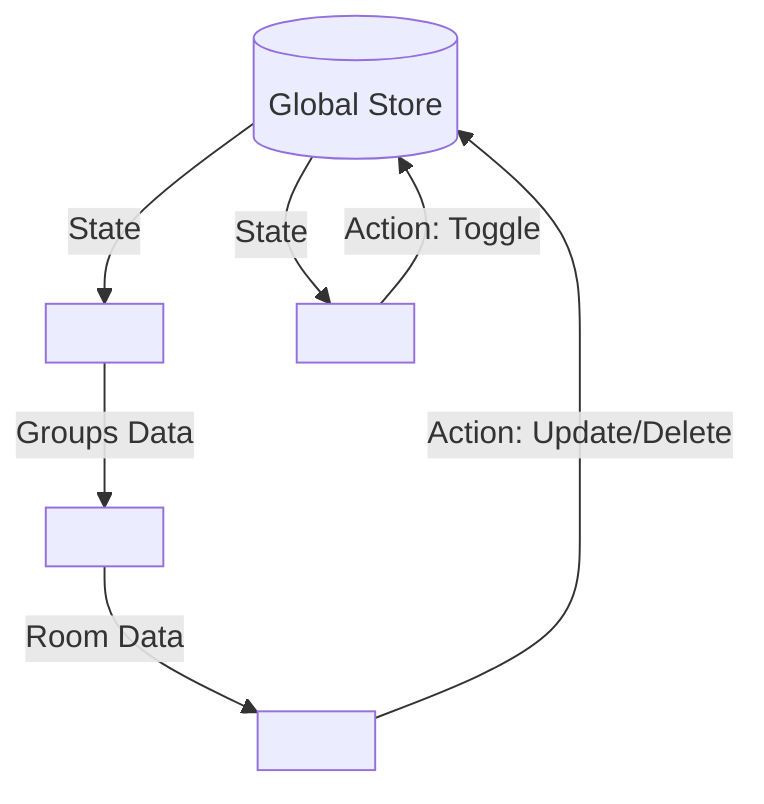

# Hotel Cart Component System

> A modular, reactive StencilJS component library for managing hotel room reservations.

  

## Table of Contents

- [Introduction](#introduction)
- [Features](#features)
- [Project Structure](#project-structure)
- [Installation](#installation)
- [Quick Start](#quick-start)
- [Architecture](#architecture)
- [Detailed Component Breakdown](#detailed-component-breakdown)
- [Integration Guide](#integration-guide)
- [Component API](#component-api)
- [Theming](#theming)

---

## Introduction

The **Hotel Cart Component System** is a lightweight, framework-agnostic UI library designed to handle complex reservation workflows. It provides a seamless "Add to Cart" experience with support for multiple hotels, room types, and dynamic pricing calculations.

Built with [StencilJS](https://stenciljs.com/), these Web Components work natively in any modern browser and integrate effortlessly with React, Vue, Angular, or vanilla JavaScript projects.

## Features

- **Store-Driven State**: Centralized reactive state management ensures real-time updates across all components.
- **Smart Grouping**: Automatically groups reservations by hotel for a cleaner UI.
- **Interactive Editing**: Inline editing for travel dates (via Flatpickr) and guest counts.
- **Responsive Design**: Fully responsive drawer layout that works on mobile and desktop.
- **Themable**: Extensive CSS variable support for easy customization.

## Project Structure

A clean, modular architecture ensures maintainability and scalability.

```
/
├── src/
│   ├── assets/                 # Shared static assets (icons, images)
│   ├── components/
│   │   ├── app-button/         # Reusable button component
│   │   ├── hotel-cart-card/    # Individual room reservation card
│   │   ├── hotel-cart-drawer/  # Slide-out cart container
│   │   ├── hotel-cart-group/   # Group container for a single hotel
│   │   ├── hotel-cart-list/    # Logic layer: groups rooms by hotel
│   │   └── theme-toggle/       # Dark/Light mode switcher
│   ├── global/
│   │   ├── app.css             # Global application styles
│   │   └── global.ts           # Global scripts
│   ├── utils/
│   │   └── data.ts             # Central State Store & Types
│   ├── index.html              # Entry point for development
│   └── index.ts                # Main export file
├── stencil.config.ts           # Stencil configuration
├── tsconfig.json               # TypeScript configuration
└── package.json                # Dependencies and scripts
```

## Installation

Ensure you have Node.js installed. Then clone the repository and install dependencies:

```bash
git clone <repository-url>
cd hotel-cart
npm install
```

To start the development server:

```bash
npm start
```

## Quick Start

To use the cart system in your application, simply include the `hotel-cart-drawer` component on your page. It acts as the main container and controller.

```html
<!DOCTYPE html>
<html lang="en">
  <head>
    <script type="module" src="/build/cart.esm.js"></script>
    <link rel="stylesheet" href="/build/cart.css" />
  </head>
  <body>
    <!-- 1. The Cart Component -->
    <hotel-cart-drawer></hotel-cart-drawer>

    <!-- 2. A Trigger Button -->
    <button id="open-cart">View Cart</button>

    <script>
      // 3. Connect the trigger
      const drawer = document.querySelector('hotel-cart-drawer');
      const btn = document.querySelector('#open-cart');

      btn.addEventListener('click', () => {
        drawer.open();
      });
    </script>
  </body>
</html>
```

## Architecture

The system follows a **Unidirectional Data Flow** pattern.

### Data Flow Diagram



1.  **Store (`utils/data.ts`)**: Holds the `rooms` array.
2.  **List**: Subscribes to the store and groups rooms by `hotelName`.
3.  **Group**: Renders a header for the hotel and a list of cards.
4.  **Card**: Displays room details and emits events to update the store.

### Data Model

The core data structure used throughout the application:

```typescript
interface RoomData {
  id: string;
  hotelName: string;
  roomType: string;
  imageUrl: string;
  adults: number;
  checkIn: string; // Format: YYYY-MM-DD
  checkOut: string; // Format: YYYY-MM-DD
  price: number;
}
```

## Detailed Component Breakdown

### 1. Hotel Cart Drawer (`<hotel-cart-drawer>`)

**Role**: The entry point for the cart UI.

- **Functionality**: Manages open/close visibility state and displays the global cart subtotal.
- **Usage**: Used in `index.html` as the main container.
- **Key Methods**: `open()`, `close()`, `toggle()`.

### 2. Hotel Cart List (`<hotel-cart-list>`)

**Role**: The data orchestration layer.

- **Functionality**: Connects to the global `cartsStore`. It checks if the cart is empty and, if not, groups the raw list of rooms by their `hotelName`.
- **Logic**: Iterates through the grouped data and renders a `<hotel-cart-group>` for each unique hotel.

### 3. Hotel Cart Group (`<hotel-cart-group>`)

**Role**: The structural container for a specific hotel's reservations.

- **Props**:
  - `hotelName` (string): The name of the hotel.
  - `item` (RoomData[]): Array of rooms for this specific hotel.
- **Functionality**: Displays the hotel header (image, name, count) and maps through the room list to render `<hotel-cart-card>` components. It also calculates and displays the specific hotel's subtotal.

### 4. Hotel Cart Card (`<hotel-cart-card>`)

**Role**: The interactive unit for a single reservation.

- **Props**:
  - `item` (RoomData): The room details.
  - `isGrouped` (boolean): Adjusts layout if inside a group.
- **Features**:
  - **Asset Loading**: Uses local SVGs from `src/assets`.
  - **Editing**: Allows users to change dates (via Flatpickr) and guest counts.
  - **State**: Manages its own temporary draft state during editing.
  - **Events**:
    - `itemUpdated`: Emitted when changes are saved.
    - `itemDeleted`: Emitted when the delete action is confirmed.

## Integration Guide

### Data Source & Fetching

Currently, the application uses a **local mock data strategy** defined in `src/utils/data.ts`.

- **Initialization**: Data is initialized immediately when the application loads via the `initialRooms` array.
- **Store**: The `cartsStore` is created using `@stencil/store`, providing a reactive state container.
- **Fetching**: In a production scenario, you would replace the static `initialRooms` with an async fetch call (e.g., `fetch('/api/cart')`) inside a `componentWillLoad` lifecycle method or a dedicated service, then populating the `cartsStore`.

### Data Propagation (Parent-Child Flow)

Data flows strictly **downwards** from the store to the components via props.

1.  **Store (`data.ts`)**: Holds the master list of all reservations.
2.  **`hotel-cart-list` (Smart Container)**:
    - Connects to `cartsStore`.
    - **Groups** the flat list of rooms by `hotelName`.
    - **Passes** the grouped arrays to `hotel-cart-group`.
3.  **`hotel-cart-group` (Presentational)**:
    - Receives `hotelName` and an array of `RoomData` as props.
    - **Iterates** through the array.
    - **Passes** individual `RoomData` objects to `hotel-cart-card`.
4.  **`hotel-cart-card` (Leaf)**:
    - Receives a single `RoomData` object as a prop.
    - Renders the UI.

### Event Bubbling & Mutation

State changes flow **upwards** or directly to the store.

- **Updates**: When a user modifies a reservation in `hotel-cart-card` (e.g., changing dates), the component emits an `itemUpdated` event.
- **Deletions**: When a user removes a room, an `itemDeleted` event is emitted.
- **Store Mutation**: The parent (`hotel-cart-group`) or the component itself calls the exported `updateRoom` / `deleteRoom` functions from `data.ts`, which mutate the store. This mutation triggers a re-render of all subscribed components (`list`, `drawer`, etc.).

## Component API

### `<hotel-cart-drawer>`

The main container that slides in from the right.

| Method     | Description               |
| :--------- | :------------------------ |
| `open()`   | Opens the drawer.         |
| `close()`  | Closes the drawer.        |
| `toggle()` | Toggles the drawer state. |

### `<hotel-cart-group>`

Displays a collection of rooms for a specific hotel.

| Property    | Type         | Description                             |
| :---------- | :----------- | :-------------------------------------- |
| `hotelName` | `string`     | **Required.** Name of the hotel.        |
| `item`      | `RoomData[]` | **Required.** List of rooms to display. |

### `<hotel-cart-card>`

Interactive card for a single room reservation.

| Property    | Type       | Description                                    |
| :---------- | :--------- | :--------------------------------------------- |
| `item`      | `RoomData` | **Required.** The room data object.            |
| `isGrouped` | `boolean`  | If `true`, adjusts styling for grouped layout. |

| Event         | Detail        | Description                                    |
| :------------ | :------------ | :--------------------------------------------- |
| `itemUpdated` | `RoomData`    | Emitted when the user changes dates or guests. |
| `itemDeleted` | `string` (ID) | Emitted when the user confirms deletion.       |

## Theming

The system uses CSS Custom Properties (Variables) for easy theming. You can override these in your global CSS.

```css
:root {
  /* Colors */
  --bg-white: #ffffff;
  --bg-color: #f9f9f9;
  --text-primary: #111827;
  --text-secondary: #6b7280;
  --accent-color: #3b82f6;

  /* Spacing */
  --radius-md: 8px;
  --radius-sm: 4px;
}
```
