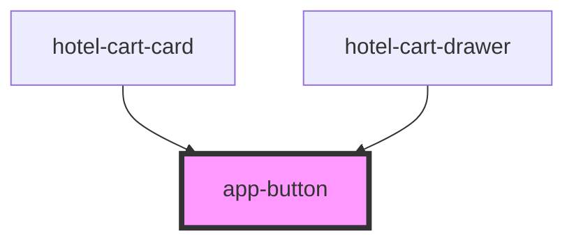

# app-button

<!-- Auto Generated Below -->

## Properties

| Property  | Attribute | Description | Type                                                                                                | Default     |
| --------- | --------- | ----------- | --------------------------------------------------------------------------------------------------- | ----------- |
| `label`   | `label`   |             | `string`                                                                                            | `undefined` |
| `square`  | `square`  |             | `boolean`                                                                                           | `false`     |
| `variant` | `variant` |             | `"action" \| "danger" \| "delete" \| "edit" \| "outline" \| "primary" \| "secondary" \| "tertiary"` | `'primary'` |

## Dependencies

### Used by

 - [hotel-cart-card](../hotel-cart-card)
 - [hotel-cart-drawer](../hotel-cart-drawer)

### Graph

----------------------------------------------

*Built with [StencilJS](https://stenciljs.com/)*
